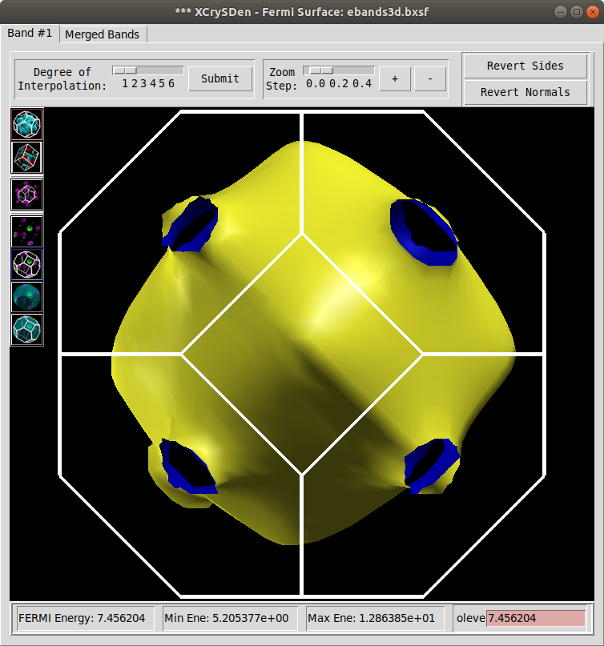
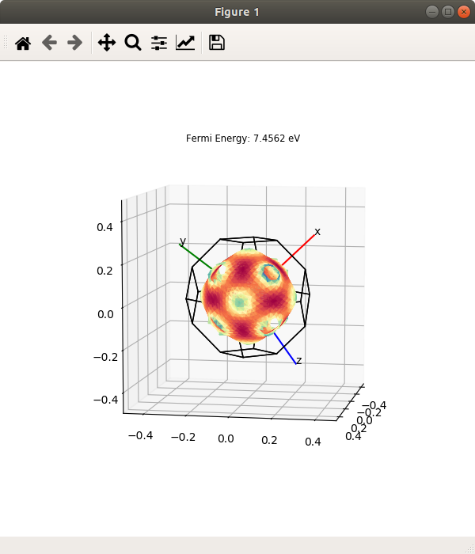
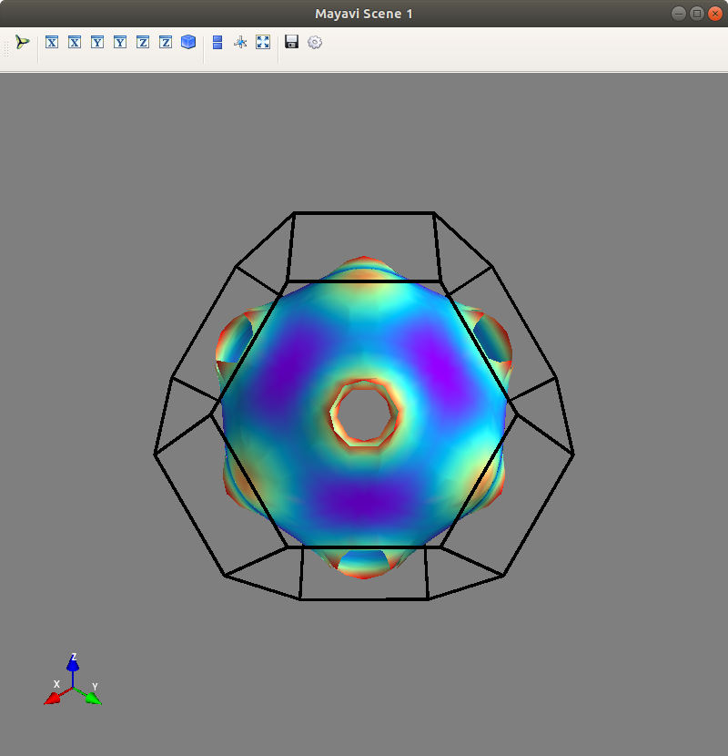
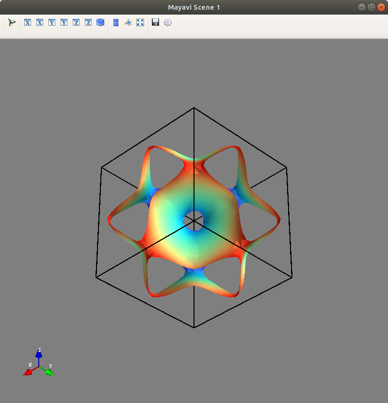
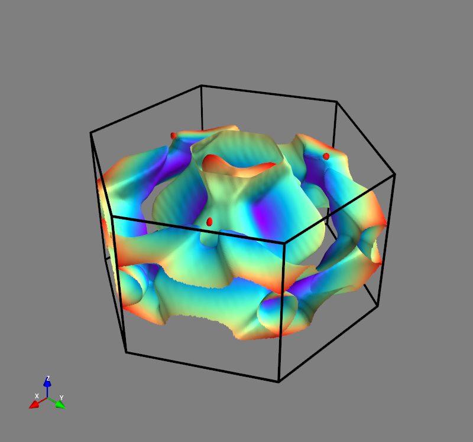

# Fermi Surface from VASP calculation

## Fermi Surface

In condensed matter physics, the [Fermi Surface](https://en.wikipedia.org/wiki/Fermi_surface) is the surface of iso-energy in the reciprocal space, the energy of which is referred to as the *Fermi energy* or *Fermi level*. To visualize the Fermi surface, first you have to obtain the band energies in the reciprocal space. For example, one can sample the reciprocal space primitive cell using a uniform k-points grid and then use any *ab initio* code, e.g. *VASP*, to generate the band energies on these uniform grid points. With the band energies on the uniform grid, one can either plot the iso-surface with some coding or just use  [Xcrysden](http://www.xcrysden.org/doc/fermi.html) to do the plotting work.

## Prerequisites

The following python library must be installed to run the script

* [ase](https://wiki.fysik.dtu.dk/ase/ase/io/io.html)
* [spglib](https://atztogo.github.io/spglib/)
* [scikit-image](https://scikit-image.org/)
* [matplotlib [optional]](https://matplotlib.org/)
* [mayavi [optional]](https://docs.enthought.com/mayavi/mayavi/)

## Steps to visualize the Fermi surface

**1. Calculate the band energies using VASP.**  

Note that Gamma-centered `KPOINTS` is required.

```
Monkhorst-Pack
0
Gamma
21 21 21
 0  0  0
```

Moreover, there is *no need* to turn off the symmetry in the `INCAR` file. As is well-known, VASP utilize the symmetry to fold the k-points grid to symmetry-irreducible k-points in the BZ, which will significantly reduce the computation cost. The script use `spglib` to unfold the irreducible k-points in BZ to the uniform k-points grid.

**2. Visualizing the Fermi surface**

At this step, use the script `fs.py` to process the `VASP` output files.

```
usage: fs.py [-h] [-i EIGVENVAL] [--poscar POSCAR] [--kpoints KPOINTS]
             [--plot {xcrys,mpl,mayavi}] [--cell {uc,bz}] [--efermi EFERMI]
             [--symprec SYMPREC] [--kmesh KMESH KMESH KMESH]

optional arguments:
  -h, --help            show this help message and exit
  -i EIGVENVAL          Location of the EIGENVAL file. By default, the
                        KPOINTS/POSCAR are also read from the directory where


  --kpoints KPOINTS     location of VASP KPOINTS
  --plot {xcrys,mpl,mayavi}
                        Fermi surface plotting method

  --efermi EFERMI       the Fermi energy
  --symprec SYMPREC     the symmetry precision used in spglib
  --kmesh KMESH KMESH KMESH
                        the kmesh in the KPOINTS
  --interp NEW_KMESH NEW_KMESH NEW_KMESH
                        the new grid size
```

There are **three** different ways to visualize the Fermi surface:

+ Using Xcrysden

First, you need to generate the `bxsf` file as input for `xcrysden`

```bash
fs.py -i EIGENVAL
```

then, launch xcrysden

```bash
xcrysden --bxsf ebands3d.bxsf
```

For example, below is the the Fermi surface of `fcc Cu`

<p align="center">
  
</p>

+ Using Matplotlib

```bash
fs.py --plot mpl
```

<p align="center">
  
</p>

+ Using Mayavi
  
  ```bash
  fs.py --plot mayavi               # Fermi Surface in Brillouin Zone
  fs.py --plot mayavi --cell uc     # Fermi Surface in primitive cell
  ```
  
  <p align="center">
  
  
  </p>

You can also use `vaspkit` ([tutorial](https://vaspkit.com/tutorials.html#fermi-surface)) to generate `KPOINTS` with given k-spacing. Since the content in `KPOINTS` is quiet different, the script requires to input `kmesh` manually.

```bash
fs.py --kmesh 42 42 24 -i EIGENVAL
fs.py --kmesh 42 42 24 --interp 210 210 120 --plot mayavi --efermi 9.05973773
```

<p align="center">
  
</p>

***

_This file was generated by Remarkable on Thursday, 27. February 2020 04:45PM_
